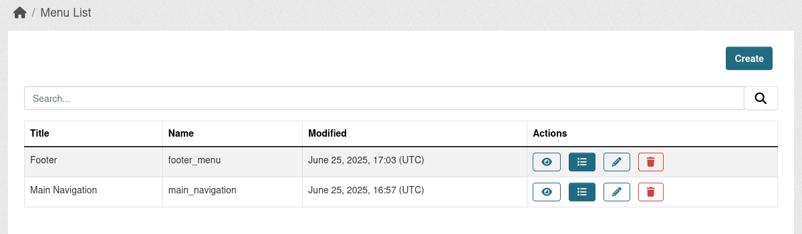

# ckanext-menu

CKAN extension that allows administrators to create and manage custom navigation menus through the CKAN interface. It provides a flexible, dynamic alternative to the default static header and footer menus.

With this extension, you can:
* Create multiple menus and define their structure using a simple interface.
* Add, edit, and sort menu items, including support for nested (multi-level) menus.
* Replace CKAN’s default header and footer menus with your own custom ones.
* Insert custom menus into different areas of your CKAN site (e.g., sidebars, pages) via templates.

This makes it easy to adapt your site navigation for various use cases without needing to modify templates directly.




Check full [documentation](https://datashades.github.io/ckanext-menu/) for more details on how to use this extension.

## Installation

1. Activate your CKAN virtual environment, for example:

     . /usr/lib/ckan/default/bin/activate

2. Clone the source and install it on the virtualenv
```
git clone https://github.com/Datashades/ckanext-menu.git
cd ckanext-menu
pip install -e .
```
3. Add `menu` to the `ckan.plugins` setting in your CKAN
   config file (by default the config file is located at
   `/etc/ckan/default/ckan.ini`).

3. Initialize `menu` table in the DB.
```
ckan -c CKAN_CONFIG_PATH db upgrade -p menu
```

4. Restart CKAN

## License

[AGPL](https://www.gnu.org/licenses/agpl-3.0.en.html)
