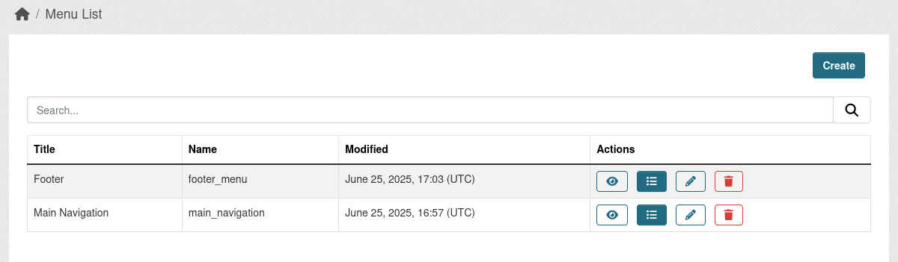
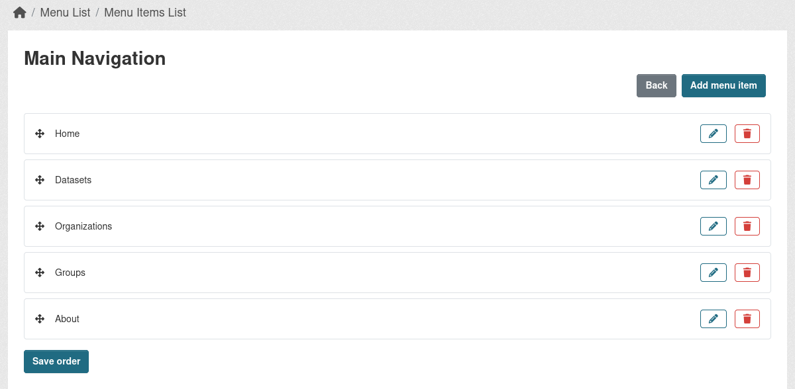

CKAN extension that allows administrators to create and manage custom navigation menus through the CKAN interface. It provides a flexible, dynamic alternative to the default static header and footer menus.

