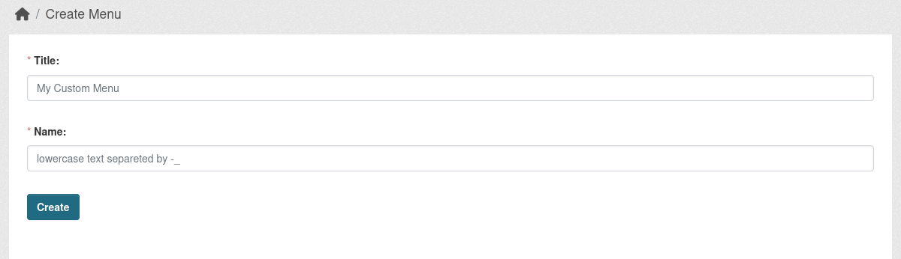
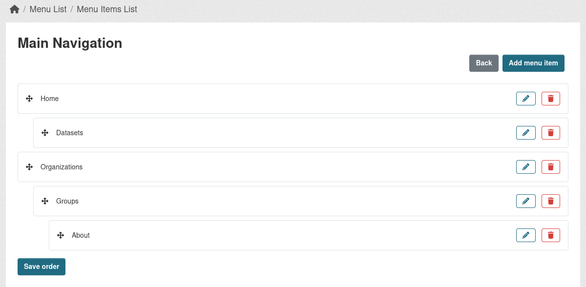

## Create a custom Menu

Go to `/menu/list` on your portal and click `Create`.

Fill the two required fields:

* Title - User friendly naming of future menu. 

* Name - should be a lowercase text separated by `-_` symbols. This field is used as an alternative to ID, but while the ID on each instance can be different, as the menus can be created an different order, `Name will stay same across all environments`.



## Add Menu items to created Menu

While being on the Menus list page, click on the `list` icon at `Actions` section, this will open an page, from where you can:

* Add new Menu items.
* View the Menu items you already created.
* Edit/Delete the Menu items.
* Re-order the Menu items.

Menu item has following fields:

* **Title** - Specify future Menu item name
* **URL** - Specify the URL it should lead to. It can be either internal or external URL. The internal URL should always start from `/`.
* **Position** - specify the place it should take in the Menu list. For example if you want it to be second, you can set it to `2`, while the first menu item will have this value set to `1`. Alterantilly you be able to modify the order from the Menu list page using UI.
* **Parent** - Can specify the parent Menu item it should be set under. Can be set on the list page.
* **Classes** - Additional classes that the `a` tag should have, separated by space.
* **Attributes** - Additional attributes that the `a` tag should have. For example if the URL is an external link and it should be opened in separate window. This attributes should be provided as an Python dictionary, where the `key` is the name if the attribute and the `value` is its value (e.g. {"target": "_blank"}).



## Adding Menu into template

Currently there is an `helper` that can be called in Jinja2 template.

Example:
```
{{ h.build_menu_tree('MENU_NAME') }}
```

This will return and rendered menu tree strucure like this:
```
<ul>
 <li>
    <a href="/some-url" class="MENU_ITEM_CLASSES" MENU_ITEM_ATTRIBUTES>Some link<a>
 </li>
 <li class="active">
    <a href="/some-url" class="active">Active Menu link<a>
 </li>
 <li>
    <a href="/some-url" >Menu link with children<a>
    <ul>
        <li>
            <a href="/some-url">Second level menu item<a>
        </li>
    </ul>
 </li>
</ul>
```

### Custom template

In `build_menu_tree` you also can specify an path to an custom snippet if you need to customize the output of the menu by providing second argument, which is an string path to the custom snippet. Example: `{{ h.build_menu_tree('MENU_NAME', 'menu/snippets/footer_menu.html') }}`. Where ` menu/snippets/footer_menu.html` is an Real path in the templates folder.

### Specific levels

In `build_menu_tree` helper, you can also specify what menu levels you expect to get.

For example you got and menu like this, where you have 3 levels (levels counting from 0, which is the top level):
```
Home
Dataset
   Dataset 1
   Dataset 2
Organization
   Org 1
      Org 2
```

Now you want to some page to show this menu, but starting from second level (e.g. 1), you can do it like this:
```
{{ h.build_menu_tree('MENU_NAME', start=1) }}
```

This will return the menu:
```
Dataset 1
Dataset 2
Org 1
   Org 2
```

Or for example, you want to have the Main navigation menu at the header to disaply only first level, but on other pages use it to render only second and third levels no matter how deep goes the menu structure:
```
Top level
{{ h.build_menu_tree('MENU_NAME', start=0, end=0) }}

Show from second level and limit by third level
{{ h.build_menu_tree('MENU_NAME', start=1, end=2) }}
```

### Top level items

While `build_menu_tree` can render the top level menu items by providing additioal params in helper, there is more suitable helper for such cases - `build_top_menu_tree`. It is much faster and solid comparing to `build_menu_tree`, as there less logic behind it.

So places where only top level Menu items are needed, better use `build_top_menu_tree`.
```
{{ h.build_top_menu_tree('MENU_NAME') }}
```

## Macros

While adding custom snippet to render menu, you can use existing `Macros` or create new for your custom Menus.

You can find example of `Macros` at `templates/menu/macros/menu.html` file in the extension, where it build the trees.

For example `default_menu_tree` build the tree without any additional code, just pure `list` structure, while `footer_menu_tree` adds additional class to the top `ul` element or `main_nav_dropdown_menu_tree`, which turns the menu structure into Boostrap 5 dropdown version.

You can create your own `Macros` or use the similar code straight into your custom snippets.